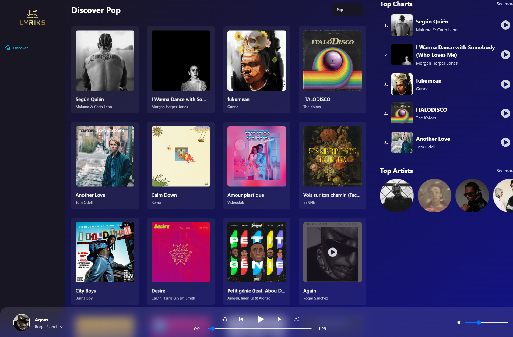
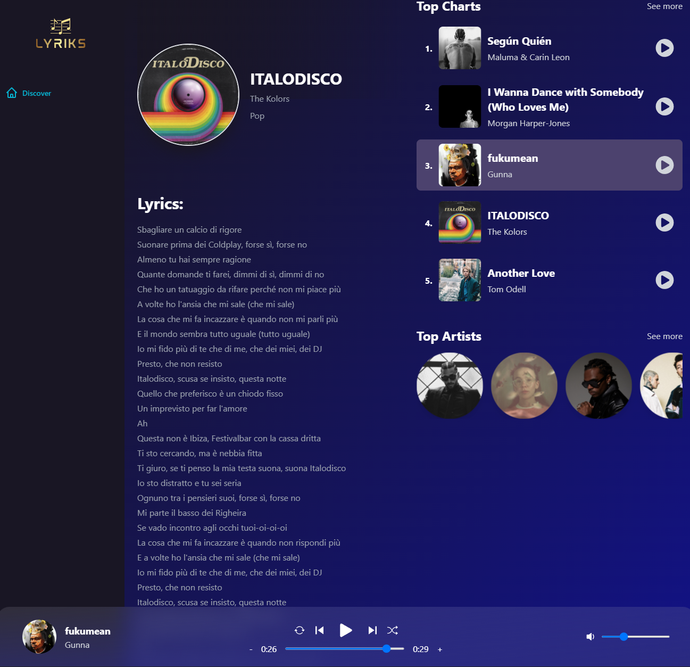
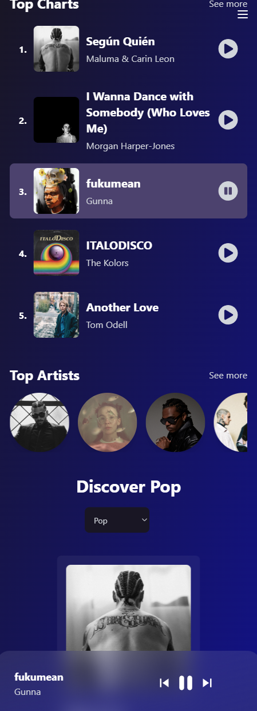

# [Lyriks Music Player](https://lyrics-spotify-clone-react-redux-tailwind-rapidapi.vercel.app/)

- React + Redux Toolkit

- [TailwindCSS](https://tailwindcss.com/)

- [RapidAPI Shazam Core API](https://www.youtube.com/redirect?event=video_description&redir_token=QUFFLUhqa1hua00yc1JDU21FWHJhb2x1STNzT2U2X0h3d3xBQ3Jtc0trMFpQYUNJQkdnMTN3Y3JhXzlrZFBuSG1ZLUdNZjQyTzNMUkdhOEx5M3EzZUFjVWY5Q2pYNUNSOE1PVUZZLXl5dXdVajFldGlLc0liSVBnRXJILU9pQXhaNktTNU4wanBkMnd4akRtM21YcTIyV09kbw&q=https%3A%2F%2Frapidapi.com%2Ftipsters%2Fapi%2Fshazam-core%3Futm_source%3Dyoutube.com%2FJavaScriptMastery%26utm_medium%3Dreferral%26utm_campaign%3DDevRel&v=I1cpb0tYV74)

Основная цель проекта - демонстрация и усовершенствование своих технологических навыков и знаний веб-разработки с использованием React + Redux Toolkit, TailwindCSS и данными из Shazam api.

Дополнительная цель проекта - предоставить любителям музыки возможность быстро и удобно находить
нужную информацию о любимых музыкальных композициях и их исполнителях. Узнавать актуальную информацию о трендах в мире музыки. Возможность просмотреть информацию о композиции - например текст песни.

Проект находится на стадии разработки и периодически обновляется.

Современная домашняя страница, полноценный музыкальный плеер, поиск, тексты песен, функции поиска, популярная музыка вокруг вас, мировые топ-чарты и многое другое - это полностью рабочее и функциональное музыкальное приложение.

+===========+

The main goal of the project is to demonstrate and improve one's technological skills and knowledge of web development using React + Redux Toolkit, TailwindCSS and data from Shazam api.

An additional goal of the project is to provide music lovers with the ability to quickly and conveniently find the
the necessary information about their favorite music tracks and their artists. Find out the latest information about trends in the world of music. Ability to view information about the song - for example, the lyrics.

The project is under development and is periodically updated.

Modern homepage, full-featured music player, search, lyrics, search functions, popular music around you, world top charts and much more - this is a fully working and functional music application.

Translated with www.DeepL.com/Translator (free version)

